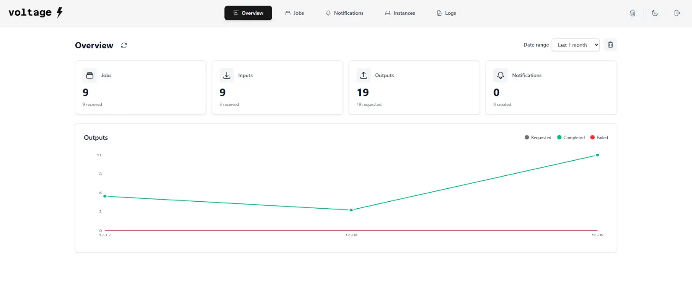
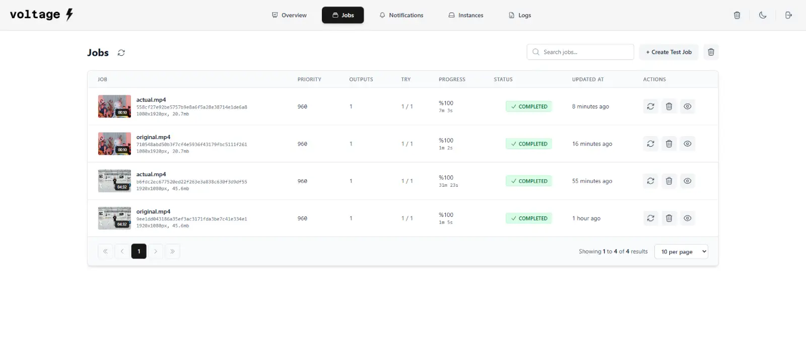
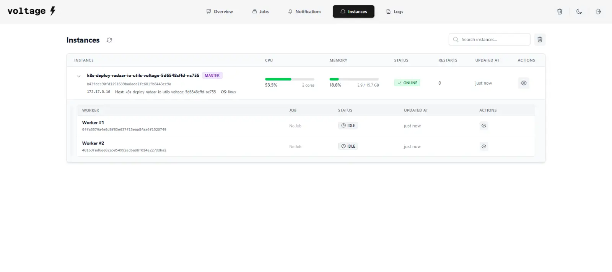

<div align="center">
  <picture>
    <source media="(prefers-color-scheme: dark)" srcset="assets/voltage-logo-light.png">
    <source media="(prefers-color-scheme: light)" srcset="assets/voltage-logo-dark.png">
    
  </picture>
</div>

<div align="center">

**Open-source, fully customizable, scalable, multi-instance, FFMPEG-based video encoding API service**

[](LICENSE) [](https://github.com/radaario/voltage)

</div>

---

  

---

## 📖 Introduction

**Voltage** is an enterprise-grade, open-source video encoding API service built for scale and flexibility. Designed and developed by **Mustafa Ercan Zırh** ([@ercanzirh](https://github.com/ercanzirh)) and **Faruk Gerçek** ([@favger](https://github.com/favger)) from [**RADAAR**](https://www.radaar.io/) — an AI-powered social media management and automation platform.

Voltage enables you to process video content at scale with:

- **Multi-instance architecture** for horizontal scaling
- **FFMPEG-based encoding** with full customization
- **Multiple storage backends** (local, S3, FTP, SFTP, and more)
- **Multiple database support** (SQLite, MySQL, PostgreSQL, and more)
- **AI-powered content analysis** with Whisper transcription and NSFW detection
- **RESTful API** for easy integration
- **Real-time monitoring** with a modern web interface
- **Job queue management** with priority handling and retry mechanisms
- **Webhook notifications** for job status updates

Whether you're building a social media platform, video streaming service, or content management system, Voltage provides the robust infrastructure you need for reliable video processing at any scale.

---

## 🔄 Alternatives

While Voltage is built for flexibility and scale, you might also consider these alternatives:

### Open Source

- **[Remotion](https://www.remotion.dev/)** - Create videos programmatically with React
- **[VideoFlow](https://github.com/VideoFlowDev/VideoFlow)** - Python-based video processing framework
- **[FFmpeg directly](https://ffmpeg.org/)** - Command-line multimedia framework (requires manual implementation)

### Commercial Services

- **[Zencoder](https://www.zencoder.com/)** - Video and audio encoding API
- **[Coconut](https://www.coconut.co/)** - Video encoding service & API for developers
- **[Mux](https://www.mux.com/)** - Video streaming and encoding API
- **[Cloudinary](https://cloudinary.com/)** - Media management and transformation
- **[AWS Elemental MediaConvert](https://aws.amazon.com/mediaconvert/)** - File-based video transcoding
- **[Azure Media Services](https://azure.microsoft.com/en-us/products/media-services)** - Cloud-based media workflows

### Why Choose Voltage?

✅ **Full control** - Self-hosted, no vendor lock-in  
✅ **Cost-effective** - No per-minute encoding fees  
✅ **Customizable** - Built on FFMPEG with full flexibility  
✅ **Scalable** - Multi-instance architecture  
✅ **AI-powered** - Built-in transcription and content analysis  
✅ **Storage agnostic** - Works with any storage backend

---

## 🛠️ Used Technologies

Voltage leverages industry-leading tools and libraries:

### Core Processing

- **[FFMPEG](https://ffmpeg.org/)** - Advanced multimedia framework for video/audio encoding, decoding, and transcoding
- **[FFPROBE](https://ffmpeg.org/ffprobe.html)** - Multimedia stream analyzer for extracting video metadata and specifications

### AI & Machine Learning

- **[Whisper](https://github.com/openai/whisper)** - OpenAI's automatic speech recognition (ASR) for audio transcription
    - Supports multiple models: TINY, BASE, SMALL, MEDIUM, LARGE variants
    - CUDA acceleration support for faster processing
- **[NSFWJS](https://nsfwjs.com/)** - Client-side indecent content checker
    - Models: MOBILE_NET_V2, MOBILE_NET_V2_MID, INCEPTION_V3
    - Configurable thresholds for content moderation

### Backend & Framework

- **[Node.js](https://nodejs.org/)** with **TypeScript** - Runtime environment
- **[Express.js](https://expressjs.com/)** - Web application framework
- **[Knex.js](https://knexjs.org/)** - SQL query builder with multi-database support

### Storage & Database

- **Multiple database engines** via Knex.js
- **Cloud storage integration** via AWS SDK and custom adapters
- **Worker threads** for parallel processing

### Frontend

- **[React](https://react.dev/)** with **TypeScript** - UI framework
- **[Vite](https://vitejs.dev/)** - Build tool and dev server
- **[Tailwind CSS](https://tailwindcss.com/)** - Utility-first CSS framework

---

## 💾 Supported Databases

Voltage supports multiple database engines for maximum flexibility:

| Database         | Type            | Use Case                        |
| ---------------- | --------------- | ------------------------------- |
| **SQLite**       | Embedded        | Development, small deployments  |
| **MySQL**        | Relational      | Production, shared hosting      |
| **MariaDB**      | Relational      | MySQL alternative               |
| **PostgreSQL**   | Relational      | Advanced features, JSON support |
| **MSSQL**        | Relational      | Microsoft environments          |
| **AWS Redshift** | Data Warehouse  | Analytics, large-scale data     |
| **CockroachDB**  | Distributed SQL | Global distribution, resilience |

Configure via `VOLTAGE_DATABASE_TYPE` environment variable.

---

## 📦 Supported Storage Services

Voltage provides unified storage abstraction for multiple providers:

### Cloud Storage (S3-Compatible)

- **AWS S3** - Amazon Web Services
- **Google Cloud Storage** - Google Cloud Platform
- **DigitalOcean Spaces** - DigitalOcean's object storage
- **Linode Object Storage** - Akamai/Linode cloud storage
- **Wasabi** - Hot cloud storage
- **Backblaze B2** - Low-cost cloud storage
- **Rackspace Cloud Files** - Rackspace cloud storage
- **Microsoft Azure Blob Storage** - Azure cloud storage
- **Other S3-Compatible** - Any S3 API compatible service

### Traditional Storage

- **Local Filesystem** - Local disk storage
- **FTP** - File Transfer Protocol (with FTPS support)
- **SFTP** - SSH File Transfer Protocol

Configure via `VOLTAGE_STORAGE_TYPE` and related environment variables.

---

## 🚀 Installation

### Prerequisites

- **Node.js** 18+ and **pnpm** package manager
- **FFMPEG** and **FFPROBE** binaries installed
- **Database** (optional - defaults to SQLite)
- **Storage** (optional - defaults to local filesystem)

### Quick Start

1. **Clone the repository**

```bash
git clone https://github.com/radaario/voltage.git
cd voltage
```

2. **Install dependencies**

```bash
pnpm install
```

3. **Configure environment variables**

```bash
cp .env.example .env
# Edit .env with your configuration
```

4. **Build the project**

```bash
pnpm build
```

5. **Start the services**

```bash
pnpm start
```

### Docker Deployment

```bash
docker-compose up -d --build
```

The service will be available at `http://localhost:8080`

### Development Mode

```bash
# Start all services in development mode
pnpm dev

# Or start individual services
pnpm dev:api        # API server only
pnpm dev:runtime    # Runtime worker only
pnpm dev:frontend   # Frontend only
```

---

## 📡 API Endpoints

All endpoints return JSON responses with this structure:

```json
{
	"metadata": {
		"version": "1.0.5",
		"env": "production",
		"status": "SUCCESSFUL"
	},
	"data": {}
}
```

### Health & Configuration

#### `GET /status` or `GET /health`

Health check endpoint

- **Auth**: Not required
- **Response**: Service status

#### `GET /config`

Get service configuration

- **Auth**: Not required
- **Response**: Sanitized configuration object

---

### Authentication

#### `POST /auth`

Authenticate to API/frontend

- **Auth**: Not required
- **Body**:
    - `password` (string) - Frontend password
- **Response**: Authentication token

---

### Statistics

#### `GET /stats`

Fetch statistics for a date range

- **Auth**: Required
- **Query Params**:
    - `since_at` (string, optional) - Start date (YYYY-MM-DD)
    - `until_at` (string, optional) - End date (YYYY-MM-DD)
- **Response**: Array of daily statistics

#### `DELETE /stats`

Delete statistics

- **Auth**: Required
- **Query Params**:
    - `all` (boolean) - Delete all stats
    - `stat_key` (string) - Delete specific stat
    - `date` (string) - Delete stats for specific date
    - `since_at` (string) - Delete from date
    - `until_at` (string) - Delete until date

---

### Logs

#### `GET /logs`

Fetch system logs

- **Auth**: Required
- **Query Params**:
    - `log_key` (string, optional) - Get specific log
    - `limit` (number, default: 25) - Results per page
    - `page` (number, default: 1) - Page number
    - `type` (string) - Filter by log type
    - `instance_key` (string) - Filter by instance
    - `worker_key` (string) - Filter by worker
    - `job_key` (string) - Filter by job
    - `output_key` (string) - Filter by output
    - `notification_key` (string) - Filter by notification
    - `q` (string) - Search query
- **Response**: Paginated logs array

#### `DELETE /logs`

Delete logs

- **Auth**: Required
- **Query Params**:
    - `all` (boolean) - Delete all logs
    - `log_key` (string) - Delete specific log
    - `since_at` (string) - Delete from date
    - `until_at` (string) - Delete until date

---

### Instances

#### `GET /instances`

List all processing instances

- **Auth**: Required
- **Query Params**:
    - `instance_key` (string, optional) - Get specific instance
    - `q` (string) - Search query
- **Response**: Array of instances with workers

#### `DELETE /instances`

Delete instances

- **Auth**: Required
- **Query Params**:
    - `all` (boolean) - Delete all instances
    - `instance_key` (string) - Delete specific instance

#### `GET /instances/workers`

List all workers

- **Auth**: Required
- **Query Params**:
    - `worker_key` (string, optional) - Get specific worker
    - `instance_key` (string) - Filter by instance
- **Response**: Array of workers

#### `DELETE /instances/workers`

Delete workers

- **Auth**: Required
- **Query Params**:
    - `all` (boolean) - Delete all workers
    - `instance_key` (string) - Filter by instance
    - `worker_key` (string) - Delete specific worker

---

### Jobs

#### `GET /jobs`

List encoding jobs

- **Auth**: Required
- **Query Params**:
    - `job_key` (string, optional) - Get specific job
    - `limit` (number, default: 25) - Results per page
    - `page` (number, default: 1) - Page number
    - `instance_key` (string) - Filter by instance
    - `worker_key` (string) - Filter by worker
    - `status` (string) - Filter by status
    - `q` (string) - Search query
- **Response**: Paginated jobs array

#### `PUT /jobs` or `POST /jobs`

Create a new encoding job

- **Auth**: Required
- **Body**: Job payload (see example below)
- **Response**: Created job object

**Example Job Payload:**

```json
{
	"config": {
		"input_analysis": true,
		"preview_generation": true,
		"nsfw_detection": false,
		"ffmpeg_preset": "FASTER",
		"whisper_model": "TINY"
	},
	"input": {
		"type": "HTTP",
		"url": "https://test-videos.co.uk/vids/bigbuckbunny/mp4/h264/1080/Big_Buck_Bunny_1080_10s_20MB.mp4"
	},
	"outputs": [
		{
			"type": "VIDEO",
			"name": "Video (720p)",
			"path": "Big_Buck_Bunny_1080_10s_20MB.mp4",
			"format": "MP4",
			"preset": "SLOW",
			"quality": 3,
			"offset": 1,
			"duration": 3,
			"width": 1280,
			"height": 720,
			"fit": "PAD",
			"rotate": 180,
			"flip": "HORIZONTAL",
			"video_codec": "libx264",
			"video_quality": 75,
			"video_bit_rate": 5000000,
			"video_pixel_format": "yuv420p",
			"video_frame_rate": 25,
			"video_profile": "BASELINE",
			"video_level": 4.0,
			"video_deinterlace": true,
			"video_first_frame_image_url": null,
			"audio_codec": "libmp3lame",
			"audio_quality": 50,
			"audio_bit_rate": 128000,
			"audio_sample_rate": 48000,
			"audio_channels": 2,
			"destination": {
				"type": "HTTPS",
				"method": "POST",
				"url": "https://httpbin.org/post",
				"headers": {
					"X-Output-Type": "720p-webm"
				}
			}
		},
		{
			"type": "AUDIO",
			"name": "Audio",
			"path": "Big_Buck_Bunny_1080_10s_20MB.mp3",
			"format": "MP3",
			"audio_codec": "libmp3lame",
			"audio_quality": 75,
			"audio_bit_rate": 128000,
			"audio_sample_rate": 48000,
			"audio_channels": 2
		},
		{
			"type": "THUMBNAIL",
			"name": "Thumbnail (Custom)",
			"path": "Big_Buck_Bunny_1080_10s_20MB.png",
			"format": "PNG",
			"image_quality": 75,
			"width": 1280,
			"height": 720,
			"offset": 1
		},
		{
			"type": "SUBTITLE",
			"name": "Subtitle (SRT)",
			"path": "Big_Buck_Bunny_1080_10s_20MB.srt",
			"format": "SRT",
			"whisper_model": "BASE",
			"whisper_cuda": false,
			"language": "AUTO"
		}
	],
	"destination": {
		"type": "HTTPS",
		"method": "POST",
		"url": "https://httpbin.org/post",
		"headers": {
			"X-Output-Type": "720p-webm"
		}
	},
	"notification": {
		"type": "HTTPS",
		"url": "https://httpbin.org/post"
	},
	"metadata": {
		"string": "String",
		"number": 123,
		"timestamp": "2025-12-23T10:30:00.000Z"
	}
}
```

#### `POST /jobs/retry`

Retry a failed job

- **Auth**: Required
- **Query Params**:
    - `job_key` (string, required) - Job to retry
    - `output_key` (string, optional) - Specific output to retry

#### `DELETE /jobs`

Delete jobs

- **Auth**: Required
- **Query Params**:
    - `all` (boolean) - Delete all jobs
    - `job_key` (string) - Delete specific job
    - `hard_delete` (boolean) - Permanently delete (including files)
    - `since_at` (string) - Delete from date
    - `until_at` (string) - Delete until date

#### `GET /jobs/preview`

Get job preview thumbnail with optional image transformations

- **Auth**: Not required
- **Query Params**:
    - `job_key` (string, required) - Job key
    - `format` (string, optional) - Output format: `WEBP` (default), `PNG`, `JPG`
    - `quality` (number, optional) - Image quality: 0-100 (default: 75)
    - `width` (number, optional) - Resize width in pixels
    - `height` (number, optional) - Resize height in pixels
    - `method` (string, optional) - Resize method: `RESIZE` (default), `FIT`, `CONTAIN`
- **Response**: Transformed image file (PNG/JPG/WEBP)

#### `GET /jobs/outputs`

List job outputs

- **Auth**: Required
- **Query Params**: Same as jobs endpoint
- **Response**: Paginated outputs array

#### `POST /jobs/outputs/retry`

Retry a failed output

- **Auth**: Required
- **Query Params**: Same as `/jobs/retry`

---

### Notifications

#### `GET /jobs/notifications`

List job notifications

- **Auth**: Required
- **Query Params**:
    - `notification_key` (string, optional) - Get specific notification
    - `limit` (number, default: 25) - Results per page
    - `page` (number, default: 1) - Page number
    - `instance_key` (string) - Filter by instance
    - `worker_key` (string) - Filter by worker
    - `job_key` (string) - Filter by job
    - `status` (string) - Filter by status
    - `q` (string) - Search query
- **Response**: Paginated notifications array

#### `POST /jobs/notifications/retry`

Retry a failed notification

- **Auth**: Required
- **Query Params**:
    - `notification_key` (string, required) - Notification to retry

#### `DELETE /jobs/notifications`

Delete notifications

- **Auth**: Required
- **Query Params**:
    - `all` (boolean) - Delete all notifications
    - `notification_key` (string) - Delete specific notification
    - `since_at` (string) - Delete from date
    - `until_at` (string) - Delete until date

---

### System

#### `DELETE /all`

Delete all data (stats, logs, instances, jobs, notifications)

- **Auth**: Required
- **Warning**: This is a destructive operation

---

## 🔧 Environment Variables

### Core Configuration

| Variable             | Type   | Default         | Description                  |
| -------------------- | ------ | --------------- | ---------------------------- |
| `VOLTAGE_NAME`       | string | `VOLTAGE`       | Service name                 |
| `VOLTAGE_VERSION`    | string | `1.1.0`         | Service version              |
| `VOLTAGE_ENV`        | string | `local`         | Environment (local/dev/prod) |
| `VOLTAGE_PROTOCOL`   | string | `http`          | Protocol (http/https)        |
| `VOLTAGE_HOST`       | string | `localhost`     | Host address                 |
| `VOLTAGE_PORT`       | number | `8080`          | Main service port            |
| `VOLTAGE_NGINX_PORT` | number | `8080`          | Nginx port                   |
| `VOLTAGE_PATH`       | string | `/`             | Base path                    |
| `VOLTAGE_TIMEZONE`   | string | `UTC`           | Timezone                     |
| `VOLTAGE_TEMP_DIR`   | string | `./storage/tmp` | Temporary files directory    |

---

### FFMPEG Configuration

| Variable                                   | Type   | Default   | Description                                 |
| ------------------------------------------ | ------ | --------- | ------------------------------------------- |
| `VOLTAGE_UTILS_FFMPEG_PATH`                | string | `ffmpeg`  | Path to FFMPEG binary                       |
| `VOLTAGE_UTILS_FFMPEG_PRESET`              | string | `DEFAULT` | Preset (DEFAULT, MEDIUM, ULTRA_FAST, etc.)  |
| `VOLTAGE_UTILS_FFMPEG_QUALITY`             | number | -         | CRF quality value (0-100, optional)         |
| `VOLTAGE_UTILS_FFPROBE_PATH`               | string | `ffprobe` | Path to FFPROBE binary                      |
| `VOLTAGE_UTILS_FFPROBE_GENERAL_ATTRIBUTES` | string | -         | General attributes (e.g., DURATION)         |
| `VOLTAGE_UTILS_FFPROBE_VIDEO_ATTRIBUTES`   | string | -         | Video attributes (e.g., WIDTH,HEIGHT,CODEC) |
| `VOLTAGE_UTILS_FFPROBE_AUDIO_ATTRIBUTES`   | string | -         | Audio attributes (e.g., CODEC,CHANNELS)     |

---

### NSFW Detection

| Variable                       | Type   | Default         | Description                                            |
| ------------------------------ | ------ | --------------- | ------------------------------------------------------ |
| `VOLTAGE_UTILS_NSFW_MODEL`     | string | `MOBILE_NET_V2` | Model (MOBILE_NET_V2, MOBILE_NET_V2_MID, INCEPTION_V3) |
| `VOLTAGE_UTILS_NSFW_SIZE`      | number | `224`           | Input image size                                       |
| `VOLTAGE_UTILS_NSFW_TYPE`      | string | `GRAPH`         | Model type (GRAPH, LITE)                               |
| `VOLTAGE_UTILS_NSFW_THRESHOLD` | number | `70`            | Detection threshold (0-100)                            |

---

### Whisper Transcription

| Variable                          | Type    | Default | Description                                    |
| --------------------------------- | ------- | ------- | ---------------------------------------------- |
| `VOLTAGE_UTILS_WHISPER_MODEL`     | string  | `BASE`  | Model (TINY, BASE, SMALL, MEDIUM, LARGE, etc.) |
| `VOLTAGE_UTILS_WHISPER_WITH_CUDA` | boolean | `false` | Enable CUDA acceleration                       |

---

### Storage Configuration

| Variable | Type | Default | Description |
| --- | --- | --- | --- |
| `VOLTAGE_STORAGE_TYPE` | string | `LOCAL` | Storage type (LOCAL, AWS_S3, GOOGLE_CLOUD_STORAGE, DO_SPACES, LINODE, WASABI, BACKBLAZE, RACKSPACE, MICROSOFT_AZURE, OTHER_S3, FTP, SFTP) |
| `VOLTAGE_STORAGE_ENDPOINT` | string | - | S3 endpoint URL |
| `VOLTAGE_STORAGE_ACCESS_KEY` | string | - | Access key ID |
| `VOLTAGE_STORAGE_ACCESS_SECRET` | string | - | Access key secret |
| `VOLTAGE_STORAGE_REGION` | string | - | Storage region |
| `VOLTAGE_STORAGE_BUCKET` | string | - | Bucket/container name |
| `VOLTAGE_STORAGE_FORCE_PATH_STYLE` | boolean | `false` | Force path style for S3 compatible services |
| `VOLTAGE_STORAGE_ACL` | string | `PUBLIC_READ` | S3-like ACL (PRIVATE, PUBLIC_READ, PUBLIC_READ_WRITE) |
| `VOLTAGE_STORAGE_EXPIRES_IN` | number | - | Expiration time in milliseconds (optional) |
| `VOLTAGE_STORAGE_CACHE_CONTROL` | string | - | Cache control header (e.g., max-age=3600) |
| `VOLTAGE_STORAGE_HOST` | string | - | FTP/SFTP host |
| `VOLTAGE_STORAGE_USERNAME` | string | - | FTP/SFTP username |
| `VOLTAGE_STORAGE_PASSWORD` | string | - | FTP/SFTP password |
| `VOLTAGE_STORAGE_SECURE` | boolean | `false` | Use FTPS (explicit TLS) |
| `VOLTAGE_STORAGE_BASE_PATH` | string | `./storage` | Base storage path |
| `VOLTAGE_STORAGE_PUBLIC_URL_BASE` | string | - | Custom public URL base |

---

### Database Configuration

| Variable | Type | Default | Description |
| --- | --- | --- | --- |
| `VOLTAGE_DATABASE_TYPE` | string | `SQLITE` | Database type (SQLITE, MYSQL, MARIADB, POSTGRESQL, MSSQL, AWS_REDSHIFT, COCKROACHDB) |
| `VOLTAGE_DATABASE_HOST` | string | `localhost` | Database host |
| `VOLTAGE_DATABASE_PORT` | number | `3306` | Database port |
| `VOLTAGE_DATABASE_USERNAME` | string | `root` | Database username |
| `VOLTAGE_DATABASE_PASSWORD` | string | - | Database password |
| `VOLTAGE_DATABASE_NAME` | string | `voltage` | Database name |
| `VOLTAGE_DATABASE_TABLE_PREFIX` | string | - | Table name prefix |
| `VOLTAGE_DATABASE_FILE_NAME` | string | `db.sqlite` | SQLite file name |
| `VOLTAGE_DATABASE_CLEANUP_INTERVAL` | number | `3600000` | Cleanup interval (ms) |

---

### Runtime Configuration

| Variable                              | Type    | Default      | Description                                  |
| ------------------------------------- | ------- | ------------ | -------------------------------------------- |
| `VOLTAGE_RUNTIME_IS_DISABLED`         | boolean | `false`      | Disable runtime service                      |
| `VOLTAGE_INSTANCES_KEY_METHOD`        | string  | `IP_ADDRESS` | Instance key method (IP_ADDRESS, UNIQUE_KEY) |
| `VOLTAGE_INSTANCES_MAINTAIN_INTERVAL` | number  | `10000`      | Maintenance interval (ms)                    |
| `VOLTAGE_INSTANCES_ONLINE_TIMEOUT`    | number  | `15000`      | Online timeout (ms)                          |
| `VOLTAGE_INSTANCES_PURGE_AFTER`       | number  | `60000`      | Purge after (ms)                             |
| `VOLTAGE_WORKERS_PER_CPU_CORE`        | number  | `1`          | Workers per CPU core                         |
| `VOLTAGE_WORKERS_BUSY_INTERVAL`       | number  | `1000`       | Worker busy check interval (ms)              |
| `VOLTAGE_WORKERS_BUSY_TIMEOUT`        | number  | `300000`     | Worker busy timeout (ms)                     |
| `VOLTAGE_WORKERS_IDLE_AFTER`          | number  | `10000`      | Worker idle after (ms)                       |

---

### API Configuration

| Variable                                   | Type    | Default                  | Description                               |
| ------------------------------------------ | ------- | ------------------------ | ----------------------------------------- |
| `VOLTAGE_API_IS_DISABLED`                  | boolean | `false`                  | Disable API service                       |
| `VOLTAGE_API_NODE_PORT`                    | number  | `4000`                   | API server port                           |
| `VOLTAGE_API_KEY`                          | string  | -                        | API authentication key                    |
| `VOLTAGE_API_REQUEST_BODY_LIMIT`           | number  | `0`                      | Request body limit (bytes, 0 = unlimited) |
| `VOLTAGE_API_SENSITIVE_FIELDS`             | string  | `password,access_secret` | Sensitive fields to sanitize              |
| `VOLTAGE_API_AUTH_RATE_LIMIT_WINDOW_MS`    | number  | `900000`                 | Auth rate limit window (ms, 15 minutes)   |
| `VOLTAGE_API_AUTH_RATE_LIMIT_MAX_REQUESTS` | number  | `5`                      | Max auth requests per window              |

---

### Frontend Configuration

| Variable                                 | Type    | Default               | Description                      |
| ---------------------------------------- | ------- | --------------------- | -------------------------------- |
| `VOLTAGE_FRONTEND_IS_DISABLED`           | boolean | `false`               | Disable frontend                 |
| `VOLTAGE_FRONTEND_NODE_PORT`             | number  | `3000`                | Frontend port                    |
| `VOLTAGE_FRONTEND_PASSWORD`              | string  | -                     | Frontend authentication password |
| `VOLTAGE_FRONTEND_DATA_REFETCH_INTERVAL` | number  | `10000`               | Data refresh interval (ms)       |
| `VOLTAGE_FRONTEND_DATETIME_FORMAT`       | string  | `YYYY-MM-DD HH:mm:ss` | DateTime format                  |
| `VOLTAGE_FRONTEND_LOCAL_STORAGE_PREFIX`  | string  | `voltage`             | LocalStorage key prefix          |

---

### Statistics & Logs

| Variable                   | Type    | Default       | Description                           |
| -------------------------- | ------- | ------------- | ------------------------------------- |
| `VOLTAGE_STATS_RETENTION`  | number  | `31536000000` | Stats retention period (ms, 365 days) |
| `VOLTAGE_LOGS_IS_DISABLED` | boolean | `false`       | Disable logging                       |
| `VOLTAGE_LOGS_RETENTION`   | number  | `3600000`     | Logs retention period (ms, 1 hour)    |

---

### Jobs Configuration

| Variable                                | Type    | Default    | Description                          |
| --------------------------------------- | ------- | ---------- | ------------------------------------ |
| `VOLTAGE_JOBS_QUEUE_TIMEOUT`            | number  | `300000`   | Queue timeout (ms, 5 minutes)        |
| `VOLTAGE_JOBS_PROCESS_INTERVAL`         | number  | `1000`     | Processing interval (ms)             |
| `VOLTAGE_JOBS_PROCESS_TIMEOUT`          | number  | `1800000`  | Processing timeout (ms, 30 minutes)  |
| `VOLTAGE_JOBS_ENQUEUE_ON_RECEIVE`       | boolean | `true`     | Auto-enqueue on receive              |
| `VOLTAGE_JOBS_ENQUEUE_LIMIT`            | number  | `10`       | Jobs per enqueue                     |
| `VOLTAGE_JOBS_RETENTION`                | number  | `86400000` | Job retention period (ms, 24 hours)  |
| `VOLTAGE_JOBS_INPUT_ANALYSIS`           | boolean | `true`     | Analyze job input                    |
| `VOLTAGE_JOBS_PREVIEW_GENERATION`       | boolean | `true`     | Generate preview for job input       |
| `VOLTAGE_JOBS_NSFW_DETECTION`           | boolean | `false`    | NSFW detection for job input         |
| `VOLTAGE_JOBS_PRIORITY`                 | number  | `1000`     | Default job priority                 |
| `VOLTAGE_JOBS_TRY`                      | number  | `3`        | Default retry attempts               |
| `VOLTAGE_JOBS_TRY_MIN`                  | number  | `1`        | Minimum retry attempts               |
| `VOLTAGE_JOBS_TRY_MAX`                  | number  | `3`        | Maximum retry attempts               |
| `VOLTAGE_JOBS_RETRY_IN`                 | number  | `60000`    | Default retry delay (ms, 1 minute)   |
| `VOLTAGE_JOBS_RETRY_IN_MIN`             | number  | `60000`    | Minimum retry delay (ms)             |
| `VOLTAGE_JOBS_RETRY_IN_MAX`             | number  | `3600000`  | Maximum retry delay (ms, 60 minutes) |
| `VOLTAGE_JOBS_PREVIEW_FORMAT`           | string  | `PNG`      | Preview format (PNG, JPG, BMP, WEBP) |
| `VOLTAGE_JOBS_PREVIEW_QUALITY`          | number  | `75`       | Preview quality (0-100)              |
| `VOLTAGE_JOBS_OUTPUTS_PROCESS_INTERVAL` | number  | `10000`    | Job outputs processing interval (ms) |

---

### Notifications Configuration

| Variable                                       | Type   | Default                             | Description                      |
| ---------------------------------------------- | ------ | ----------------------------------- | -------------------------------- |
| `VOLTAGE_JOB_NOTIFICATIONS_PROCESS_INTERVAL`   | number | `1000`                              | Processing interval (ms)         |
| `VOLTAGE_JOB_NOTIFICATIONS_PROCESS_LIMIT`      | number | `10`                                | Notifications per poll           |
| `VOLTAGE_JOB_NOTIFICATIONS_NOTIFY_ON`          | string | `RECEIVED,COMPLETED,FAILED,TIMEOUT` | Default notification events      |
| `VOLTAGE_JOB_NOTIFICATIONS_NOTIFY_ON_ALLOWEDS` | string | `RECEIVED,PENDING,RETRYING,...`     | Allowed notification events      |
| `VOLTAGE_JOB_NOTIFICATIONS_TIMEOUT`            | number | `10000`                             | Notification timeout (ms)        |
| `VOLTAGE_JOB_NOTIFICATIONS_TIMEOUT_MAX`        | number | `30000`                             | Maximum timeout (ms)             |
| `VOLTAGE_JOB_NOTIFICATIONS_TRY`                | number | `3`                                 | Default retry attempts           |
| `VOLTAGE_JOB_NOTIFICATIONS_TRY_MIN`            | number | `1`                                 | Minimum retry attempts           |
| `VOLTAGE_JOB_NOTIFICATIONS_TRY_MAX`            | number | `3`                                 | Maximum retry attempts           |
| `VOLTAGE_JOB_NOTIFICATIONS_RETRY_IN`           | number | `60000`                             | Retry delay (ms, 1 minute)       |
| `VOLTAGE_JOB_NOTIFICATIONS_RETRY_IN_MIN`       | number | `60000`                             | Minimum retry delay (ms)         |
| `VOLTAGE_JOB_NOTIFICATIONS_RETRY_IN_MAX`       | number | `3600000`                           | Maximum retry delay (ms, 1 hour) |

---

## 📄 License

This project is open-source and available under the MIT License.

---

## 👥 Authors

Developed with ⚡ by the RADAAR team:

- **[Mustafa Ercan Zırh](https://github.com/ercanzirh)** - Core Developer
- **[Faruk Gerçek](https://github.com/favger)** - Core Developer

---

## 🏢 About RADAAR

[**RADAAR**](https://www.radaar.io/) is an AI-powered social media management and automation platform that helps businesses and creators streamline their social media workflow. Voltage was built to power RADAAR's video processing infrastructure and is now available as an open-source project for the community.

---

# Contributing to Voltage

## 🙏 Welcome Contributors!

Thank you for your interest in contributing to Voltage!

## How to Contribute

### Reporting Bugs

- Use GitHub Issues
- Include reproduction steps
- Provide system info (OS, Node version, etc.)

### Feature Requests

- Open an issue with [FEATURE] tag
- Describe use case
- Explain expected behavior

### Pull Requests

1. Fork the repository
2. Create a feature branch (`git checkout -b feature/AmazingFeature`)
3. Commit changes (`git commit -m 'Add some AmazingFeature'`)
4. Push to branch (`git push origin feature/AmazingFeature`)
5. Open a Pull Request

### Coding Standards

- Use TypeScript
- Follow existing code style
- Add tests for new features
- Update documentation

---

## ⭐ Support

If you find Voltage useful, please consider giving it a star on GitHub!

---

<div align="center">
  <a href="https://radaar.io" title="RADAAR" target="_blank">
    <picture>
      <source media="(prefers-color-scheme: dark)" srcset="assets/radaar-developed-by-light.svg">
      <source media="(prefers-color-scheme: light)" srcset="assets/radaar-developed-by-dark.svg">
      
    </picture>  
  </a>
</div>
